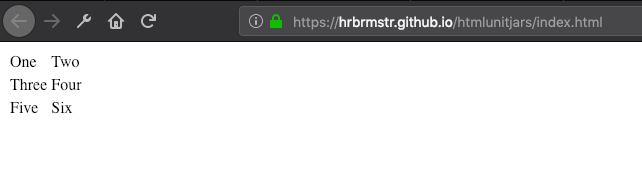

[](https://travis-ci.org/hrbrmstr/htmlunit)
[](https://codecov.io/github/hrbrmstr/htmlunit?branch=master)
[](https://cran.r-project.org/package=htmlunit)

# htmlunit

Tools to Scrape Dynamic Web Content via the ‘HtmlUnit’ Java Library

## Description

`HtmlUnit` (<http://htmlunit.sourceforge.net/>) is *a “‘GUI’-Less
browser for ‘Java’ programs”. It models ‘HTML’ documents and provides an
‘API’ that allows one to invoke pages, fill out forms, click links and
more just like one does in a “normal” browser. The library has fairly
good and constantly improving ‘JavaScript’ support and is able to work
even with quite complex ‘AJAX’ libraries, simulating ‘Chrome’, ‘Firefox’
or ‘Internet Explorer’ depending on the configuration used. It is
typically used for testing purposes or to retrieve information from web
sites.*

Tools are provided to work with this library at a higher level than
provided by the exposed ‘Java’ libraries in the
[`htmlunitjars`](https://gitlab.com/hrbrmstr/htmlunitjars) package.

## What’s Inside The Tin

The following functions are implemented:

### DSL

  - `web_client`/`webclient`: Create a new HtmlUnit WebClient
    instance<br/><br/>

  - `wc_go`: Visit a URL<br/>

  - `wc_html_nodes`: Select nodes from web client active page html
    content

  - `wc_html_text`: Extract attributes, text and tag name from webclient
    page html content<br/><br/>

  - `wc_html_attr`: Extract attributes, text and tag name from webclient
    page html content

  - `wc_html_name`: Extract attributes, text and tag name from webclient
    page html content

  - `wc_headers`: Return response headers of the last web request for
    current page

  - `wc_browser_info`: Retreive information about the browser used to
    create the ‘webclient’

  - `wc_content_length`: Return content length of the last web request
    for current page

  - `wc_content_type`: Return content type of web request for current
    page<br/><br/>

  - `wc_render`: Retrieve current page contents<br/><br/>

  - `wc_css`: Enable/Disable CSS support

  - `wc_dnt`: Enable/Disable Do-Not-Track

  - `wc_geo`: Enable/Disable Geolocation

  - `wc_img_dl`: Enable/Disable Image Downloading

  - `wc_load_time`: Return load time of the last web request for current
    page

  - `wc_resize`: Resize the virtual browser window

  - `wc_status`: Return status code of web request for current page

  - `wc_timeout`: Change default request timeout

  - `wc_title`: Return page title for current page

  - `wc_url`: Return load time of the last web request for current page

  - `wc_use_insecure_ssl`: Enable/Disable Ignoring SSL Validation Issues

  - `wc_wait`: Block HtlUnit final rendering blocks until all background
    JavaScript tasks have finished executing

### Just the Content (pls)

  - `hu_read_html`: Read HTML from a URL with Browser Emulation & in a
    JavaScript Context

## Installation

``` r
devtools::install_github("hrbrmstr/htmlunitjars")
devtools::install_github("hrbrmstr/htmlunit")
```

## Usage

``` r
library(htmlunit)

# current verison
packageVersion("htmlunit")
## [1] '0.1.0'
```

Something `xml2::read_html()` cannot do, read the table from
<https://hrbrmstr.github.io/htmlunitjars/index.html>:



``` r
test_url <- "https://hrbrmstr.github.io/htmlunitjars/index.html"

pg <- xml2::read_html(test_url)

html_table(pg)
## list()
```

☹️

But, `hu_read_html()` can\!

``` r
pg <- hu_read_html(test_url)

html_table(pg)
## [[1]]
##      X1   X2
## 1   One  Two
## 2 Three Four
## 3  Five  Six
```

All without needing a separate Selenium or Splash server instance.

### DSL

``` r
wc <- web_client()

wc %>% wc_browser_info()
## < Netscape / 5.0 (Windows NT 6.1; Win64; x64) AppleWebKit/537.36 (KHTML, like Gecko) Chrome/68.0.3440.106 Safari/537.36 / en-US >

wc <- web_client()

wc %>% wc_go("https://usa.gov/")

# if you want to use purrr::map_ functions the result of wc_html_nodes() needs to be passed to as.list()

wc %>%
  wc_html_nodes("a") %>%
  sapply(wc_html_text, trim = TRUE) %>% 
  head(10)
##  [1] "Skip to main content"      ""                          "1-844-USA-GOV1"            "All Topics and Services"  
##  [5] "Benefits"                  "Help with Bills"           "Grants and Loans"          "Food Assistance"          
##  [9] "Social Security Questions" "Affordable Rental Housing"

wc %>%
  wc_html_nodes(xpath=".//a") %>%
  sapply(wc_html_text, trim = TRUE) %>% 
  head(10)
##  [1] "Skip to main content"      ""                          "1-844-USA-GOV1"            "All Topics and Services"  
##  [5] "Benefits"                  "Help with Bills"           "Grants and Loans"          "Food Assistance"          
##  [9] "Social Security Questions" "Affordable Rental Housing"

wc %>%
  wc_html_nodes(xpath=".//a") %>%
  sapply(wc_html_attr, "href") %>% 
  head(10)
##  [1] "#skiptarget"            "/"                      "/phone"                 "/topics"               
##  [5] "/benefits"              "/help-with-bills"       "/grants"                "/food-help"            
##  [9] "/about-social-security" "/finding-home"
```

Handy function to get rendered plain text for text mining:

``` r
wc %>% 
  wc_render("text") %>% 
  substr(1, 300) %>% 
  cat()
## Official Guide to Government Information and Services | USAGov
## Skip to main content
## 
## 
## An official website of the United States government Here's how you know
## 
## 
## 
## 
## 
## 
## 
## 
## 
## 
## Search
##  Search
## 
## 
## Search
##  1-844-USA-GOV1
## 
## 
## 
## All Topics and Services
## 
## 
## Benefits, Grants, Loans
## 
## 
## Government Agencies and Elected Offic
```
